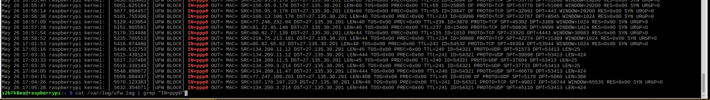

# ファイアウォール(ufw)の使い方

- ## 設定例（Raspberry piでルーターを構成した際の設定)
    - WANからppp0に対して来るポートアクセスはすべてブロック
    - br0(wlan0,wlan1)からppp0-WANに対する通信はすべて許可
    - VNC,SSHでラジパイを操作するため、br0でポート(5900,51066)は開放
    - br0でルーター機能(DNS,DHCP)のポート(53,67)は開放
    - Logging LevelはLow(ブロックした通信を記録)
    - WAN側からルーターの各種ポートに対して、ブロック確認済み
    - pingの応答拒否

- ### ufw,gufw(GUI)のインストール    
    > sudo apt -y install ufw gufw

- ### 最初に全ポートの外部アクセス拒否    
    > sudo ufw default deny   

- ### gufwの起動
    > sudo gufw    

    Status:オン,incomming:denyであることを確認   
    

- ### ステーション(子機)に対して必要なポートの開放    
    - プロファイルをインポートして設定する場合   
        ./RasFi_Router/config/gufw/にある[プロファイル](./gufw/gufw_conf.profile)をインポートして設定する。   
        ただし、インポートする前にプロファイルに権限を付与
        > sudo chmod 600 ~/RasFi_Router/config/gufw/gufw_conf.profile

        **インポート後GUIの左上にあるプロファイルのドロップダウンリストからgufw_confを選択**

    - 手動で設定する場合
        - 51066/TCP on br0 [変更したSSH用ポート]   
            
        - 5900/TCP on br0  [VNC server用]   
            
        - 53/UDP on br0    [DNS server用]   
            
        - 67/UDP on br0    [DHCP server用]   
            

    これを設定しないとSSHやVNCでラズパイにアクセスできなくなる   
    DNSを開放しないと名前解決がされずネットにアクセスできない   
    DHCPは、IPアドレス割当のため   
    ***外部からのポートアクセス*** を絶対許可しないこと
    
- #### pingのアクセス拒否
    「/etc/ufw/before.rules」にある以下の行の ACCEPT を DROP に変更する 
    
    > sudo emacs /etc/ufw/before.rules  

    ~~~
    # ok icmp codes for INPUT
    -A ufw-before-input -p icmp --icmp-type destination-unreachable -j DROP
    -A ufw-before-input -p icmp --icmp-type source-quench -j DROP
    -A ufw-before-input -p icmp --icmp-type time-exceeded -j DROP
    -A ufw-before-input -p icmp --icmp-type parameter-problem -j DROP
    -A ufw-before-input -p icmp --icmp-type echo-request -j DROP
    ~~~

- ### ファイアウォールの有効化＆自動起動    
    > sudo ufw enable   
    > sudo systemctl enable ufw   

- ### 設定の確認
    > sudo ufw status verbose
    ~~~
    Status: active
    To                         Action      From
    --                         ------      ----
    51066/tcp on br0           ALLOW       Anywhere                   (log)
    53/udp on br0              ALLOW       Anywhere                   (log)
    67/udp on br0              ALLOW       Anywhere                   (log)
    5900/tcp on br0            ALLOW       Anywhere                   (log)
    51066/tcp (v6) on br0      ALLOW       Anywhere (v6)              (log)
    53/udp (v6) on br0         ALLOW       Anywhere (v6)              (log)
    67/udp (v6) on br0         ALLOW       Anywhere (v6)              (log)
    5900/tcp (v6) on br0       ALLOW       Anywhere (v6)              (log)
    ~~~
- セキュリティチェック   
    WAN側からnmapを使用することで各ポートの状態を把握することができる   
    [攻撃者の心理：Nmapを使ったネットワーク解析の実践](https://se-cure.info/?p=2318#Nmap-3)   
    [nmapコマンドで覚えておきたい使い方11個](https://orebibou.com/2015/06/nmap%E3%82%B3%E3%83%9E%E3%83%B3%E3%83%89%E3%81%A7%E8%A6%9A%E3%81%88%E3%81%A6%E3%81%8A%E3%81%8D%E3%81%9F%E3%81%84%E4%BD%BF%E3%81%84%E6%96%B911%E5%80%8B/#OS)   
    [「Nmap」を使ったセキュリティチェック 1ページ](https://mag.osdn.jp/13/04/01/140000/1)
    
    - sfsdf
        > lastb -f /var/log/wtmp.1
    
    - 不正ログインのログ
        > sudo lastb   
        ~~~
        btmp begins Sat Jun  1 22:37:55 2019<ファイルが生成された時間を表す>
        ~~~
    - ログインの際、異なるパスワードを入力した時のログ
        > sudo grep 'Failed password' /var/log/auth.log

    - 外部のサーバーからルーターのポートが開放されていないか確認できるサービス
        https://seo.atompro.net/webtoolfree_portscan_.html   
        https://viewdns.info/    
        https://www.atmarkit.co.jp/fsecurity/rensai/securitytips/006portscan.html   
        [自己診断サービス『自診くん』](https://jisin.lac.co.jp/?_ga=2.137645616.1264313564.1559736281-1641168572.1559391709)

- ufw のログの確認(アクセスしてくる輩の観察)   
    外部からのアクセスブロックログ
    > grep "IN=ppp0" /var/log/ufw.log 
    

    内部からのアクセスブロックログ
    > grep "IN=br0" /var/log/ufw.log 
    
    80ポートのアクセスブロックログ
    > grep "DPT=80" /var/log/ufw.log
    
    日付指定
    > grep "Jun  8" /var/log/ufw.log | grep "IN=ppp0"

    - wc -lを付けることで個数も確認できる
        > grep "Jun  8" /var/log/ufw.log | grep "IN=ppp0" | wc -l

    - ログの読み方   
        https://nekonenene.hatenablog.com/entry/ufw-log-meaning

- ### 参考サイト
    [第76回　Ubuntuのソフトウェアファイアウォール：UFWの利用（1）](http://gihyo.jp/admin/serial/01/ubuntu-recipe/0076?page=1)   
    [raspberry pi3でファイアウォールを設定する](https://www.kmrweb.net/server/firewall.html)   
    [Ubuntu で ufw を利用して ping を拒否する設定](http://www.sakito.com/2012/10/ubuntu-ufw-ping.html)